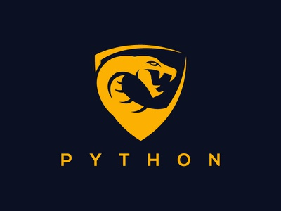

<h1 align="center"><b>Python : Basic to Advance</b></h1>

  
 

A tutorial for those who wanna make success in Python, here will be covering Python Basics to Advance, with 4 projects to work upon including database with SQLite, Web Scraping and Many more..., so stay tuned for more..
 
<b>This Consists of 23 Seasons with 341 Episodes with a total time of 35.5 Hours</b>
  
<h2><b>What you’ll learn</b></h2>
1. From foundations to expert, learn about every major Python topic, working with Python 3. 
2. Write professional-grade Pythonic code with all the best practices and avoiding common pitfalls. 
3. Master Object-Oriented Programming and structure your Python programs like a professional. 
4. Swiftly understand complex topics like decorators, algorithms, and asynchronous programming in Python. 
5. Automate extracting data from websites using web scraping libraries like BeautifulSoup and Selenium. 
6. Learn how to write desktop applications with Python and Tkinter. 
7. Interact with REST APIs using Python and build a currency converter! 
8. Develop a life-long love for programming with Python!  

<h3><b>You will:</b></h3>
1. Get a broader and deeper experience in Python than with any other Udemy course on the market. 
2. Start at zero and become an expert whilst learning all about the inner workings of Python. 
3. Learn how to write professional Python code like a professional Python developer. 
4. Develop a long-lasting love for Python and programming by creating good programming habits. 
5. Explore the wider possibilities of what you can do with Python, including databases, web development and web scraping. 
7. Become job-ready by learning about best practices, Selenium, unit testing, and all of the major Python topics. 

<h2><b>Are there any course requirements or prerequisites?</b></h2>
1. Access to a computer with an internet connection. Everything else we use is publicly available and i'll guide you through getting it. 
2. There are no other requirements, besides getting started!  

  
 

